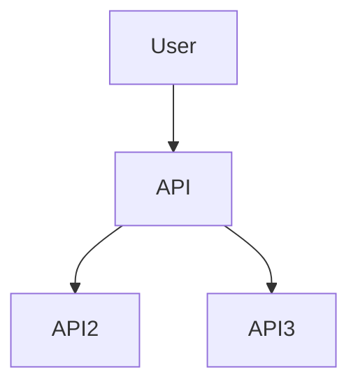

- Build an example WebAPI that invokes 2 other WebAPIs
  - Calls should occur from the front-end WebAPI to the 2 back-end APIs in an Asynchronous manner
  - Artificial delays can be introduced to mimic a longer running operation in API2 and API3
  - Front-end Web API to support Get/Post verbs
  - Be prepared to discuss options to secure front-end API

